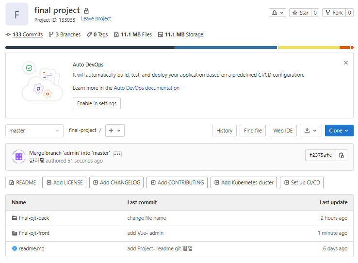
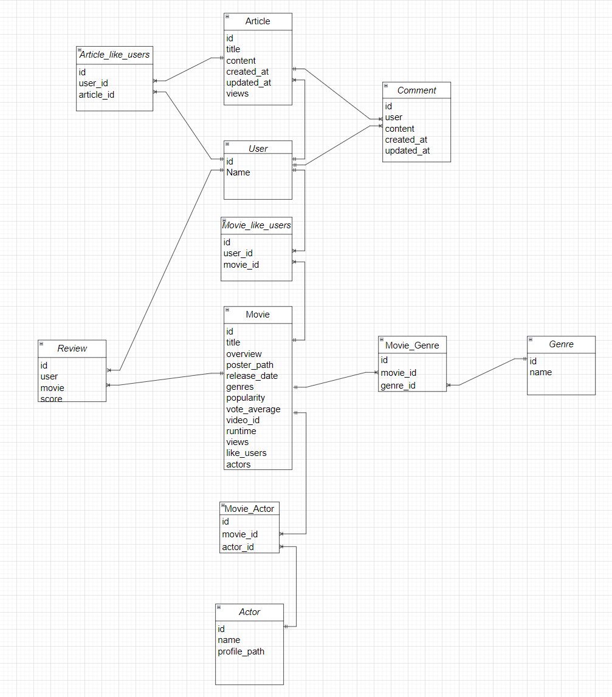
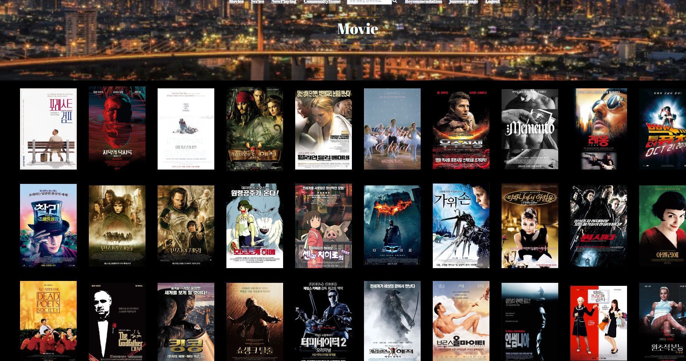
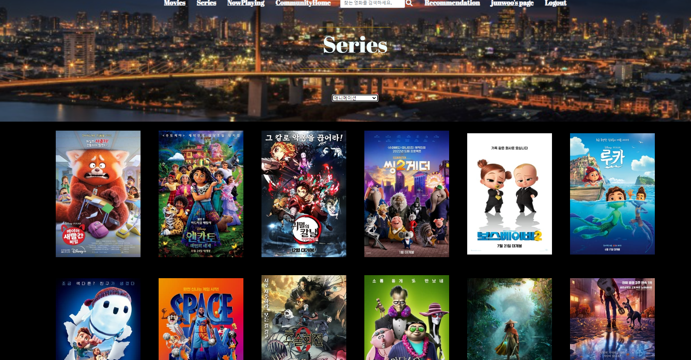
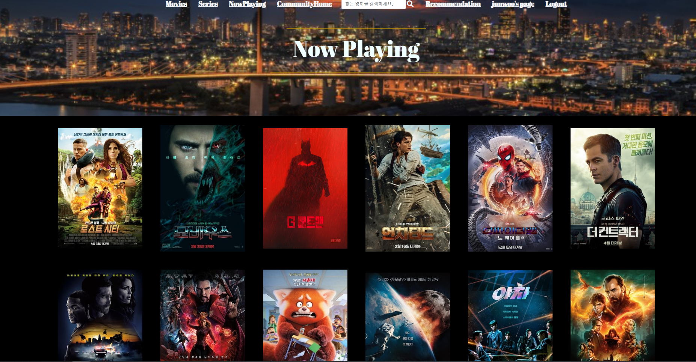
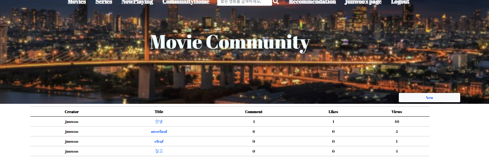
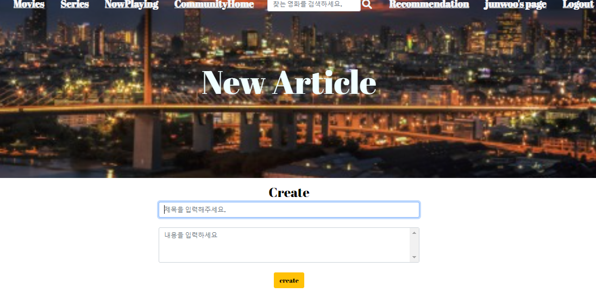
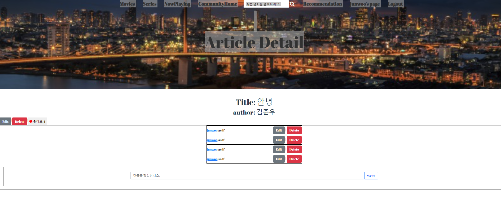
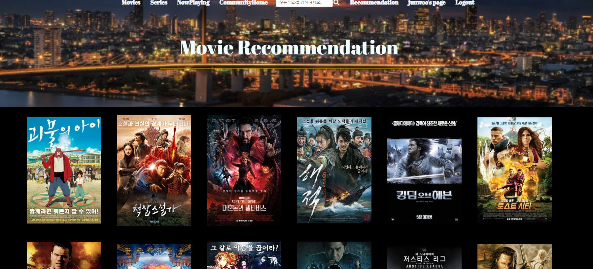
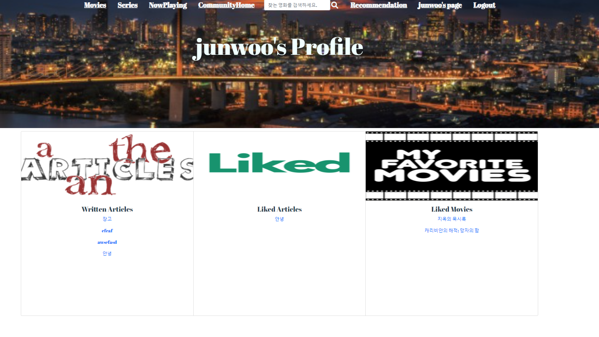

# 우하한 형제들 - 영화 추천 웹 서비스

## 개발 환경(사용 프로그램)

### Django 3.2.12 (백엔드)

### vue/cli 4.5.8 (프론트엔드)

### git/gitlab(협업 툴)

> git 협업 시작

1. 팀장이 git repositary 생성 및 팀원 초대
2. 팀원 git clone

>  git branch 생성

- git branch 만들기 : `git checkout -b branch이름`
- 기능 구현
- `git add .`
- `git commit -m 'commit message'`
- `git push origin branch이름`
- merge request 
- git master로 이동 : `git checkout master`
- git 최신화 : `git pull origin master`
- 작업한 git branch 삭제 : `git branch -d branch이름`
- 다시 branch 생성하면서 다음 작업 시작

> commit message  행동 [Vue, DRF] - 기능 

- add : 기능 추가
- update : 기능 수정
- remove : 기능 삭제
- error : 에러 해결

- 예시 : add DRF - url 현재 상영 영화



## 1. 팀원 정보 및 업무 분담내역

팀장: 한하평 (백엔드)

- DRF 총괄

- 데이터베이스 관리 및 구성
- ERD 작성
- 데이터베이스 모델링
- API 데이터 관리 가져오기

​	

팀원: 김준우

- Vue.js 총괄
- UI/UX 관리
- 컴포넌트 구조 작성
- CSS/HTML 작성
- 전반적인 화면구성 기획

## 2. 목표 서비스 구현 및 실제 구현 정도

### 목표 구성

- 로그인 로그아웃 : google로 로그인하기
- 영화 추천 : 영화 추천 알고리즘
- 게시판 : 영화리뷰
- 댓글
- 좋아요, 평점 등
- 유튜브 영상 링크
- 위치 기반 주변 영화관 검색 + 인스타, 블로그 후기 연동
- 배경음악
- UI  (ex : 싸이월드 등)
- 팝업창


### 실제 구성

- 로그인 로그아웃 
- 영화 추천 : 영화 추천 알고리즘 (좋아요 기반)
- 게시판 : 영화리뷰
- 댓글
- 좋아요, 평점 등
- 유튜브 영상 링크
- UI (bootstrap 깔끔한 스타일)
- 무한 스크롤
- 장르별 영화
- 영화 검색 기능


## 3. 데이터베이스 모델링(ERD)

 #### ERD



#### 컴포넌트 구조


accounts/models.py

``` python
from django.db import models
from django.contrib.auth.models import AbstractUser

# Create your models here.
class User(AbstractUser):
    pass
```


articles/models.py

```python
from django.db import models
from django.conf import settings

class Article(models.Model):
    user = models.ForeignKey(settings.AUTH_USER_MODEL, on_delete=models.CASCADE, related_name='articles')
    title = models.CharField(max_length=100)
    content = models.TextField()
    created_at = models.DateTimeField(auto_now_add=True)
    updated_at = models.DateTimeField(auto_now=True)
    like_users = models.ManyToManyField(settings.AUTH_USER_MODEL, related_name='like_articles')
    views = models.IntegerField(default=0)
    


class Comment(models.Model):
    user = models.ForeignKey(settings.AUTH_USER_MODEL, on_delete=models.CASCADE, related_name='comments')
    article = models.ForeignKey(Article, on_delete=models.CASCADE, related_name='comments')
    content = models.CharField(max_length=200)
    created_at = models.DateTimeField(auto_now_add=True)
    updated_at = models.DateTimeField(auto_now=True)

```


movies/models.py

``` python
from django.db import models
from django.conf import settings

# Create your models here.
class Genre(models.Model):
    name = models.CharField(max_length=50)

class Actor(models.Model):
    name = models.CharField(max_length=100)
    profile_path = models.CharField(max_length=200, null=True)

class Movie(models.Model):
    title = models.CharField(max_length=100)
    overview = models.TextField()
    poster_path = models.CharField(max_length=200)
    release_date = models.DateField()
    genres = models.ManyToManyField(Genre, related_name='movies')
    actors = models.ManyToManyField(Actor, related_name='movies')
    popularity = models.FloatField()
    vote_average = models.FloatField()
    video_id = models.TextField()
    runtime = models.IntegerField()
    views = models.IntegerField(default=0)
    like_users = models.ManyToManyField(settings.AUTH_USER_MODEL, related_name='like_movies')

class Review(models.Model):
    user = models.ForeignKey(settings.AUTH_USER_MODEL, on_delete=models.CASCADE, related_name='reviews')
    movie = models.ForeignKey(Movie, on_delete=models.CASCADE, related_name='reviews')
    score = models.IntegerField(null=True)
```


## 4. 필수 기능에 대한 설명


### 메인 화면



모든 영화 데이터들을 가져와 무한 스크롤 형태로 영화들을 보여준다.


### Navbar


- 전체영화 조회
- 장르별 영화
- 현재 상영 영화
- 영화 게시판
- 영화 검색
- 추천 영화
- 프로필
- 로그인/로그아웃/회원가입


### 장르별 영화


영화 장르를 선택하면 같은 장르 영화를 모두 보여준다.




### 현재 상영 영화



released date를 기준으로 설정한 기간 이후에 영화들을 반환해줘서 현재 상영중인 영화 페이지를 만들었따.


### 영화 게시판



영화 게시판을 만들어서 댓글, 좋아요, 조회수가 나오게 만들었다. 

게시글 작성,수정,삭제도 가능하며, 댓글 추가 삭제 수정도 가능하다.





### 영화 검색


navbar에 원하는 영화 이름을 검색하면 그 영화가 나온다.


### 영화 추천




유저가 좋아요한 영화를 기반으로 비슷한 장르의 영화들을 추천해준다.


### 유저 프로필



프로필 페이지에 들어가면 유저가 작성한 글, 좋아요한 글, 좋아요한 영화목록이 나온다.


### Login/Logout/Signup

로그인,로그아웃, 회원가입 기능이 활성화된다.


## 5. 느낀점

### 1. 분야 나누기의 중요성

지금까지 백엔드와 프론트엔드의 경계선이 없었다. DRF를 통해 화면을 보여주는것도 가능했고, vue.js를 통해 원하는 비동기요청 페이지를 쉽게 구현했다. 하지만 새로운 데이터베이스를 처음부터 가지고오는 작업과 백엔드와 프론트엔드의 분야를 나눠서 개발을 해야하는 이유를 알았다. 작업량이 어마어마했고, 기능 구현의 경계선은 너무나 확실했다. 처음에는 페어와 함께 같이 다하자는 생각이었지만, 그렇게 하게되면 시간낭비와 효율이 많이 떨어졌다. 이번 프로젝트를 통해 분야의 경계를 확실히 알게되었다.


### 2. 협업 툴의 중요성(데이터의 저장 및 관리)

협업을 하면서 git/gitlab을 활용했다. 매번 교수님이 올려주신 코드를 clone하고 pull하는게 다였는데 이제는 페어와 함께 작업을 하게 되어서 git merge 및 branch 활용을 했다. 처음에는 너무 복잡하고 어떤 형태로 이루어지는지 알 수가 없었고, 충돌이 상당히 많이났다. 그럴때면 이 문제만 해결하는데 2~3시간을 썼었는데 그렇게 많은 시행착오를 겪고 나니 왜 협업할때 git을 쓰는지 이해했다.버전관리는 너무나 중요했고, 페어의 작업과 나의 작업을 연동시켜주는 git은 너무나 유용하고 좋은 툴이었다.


### 3. 멘탈과 실패의 중요성(끊임없는 검색과 문제해결능력)

수업시간에 배운 내용만으로는 경험이 상당히 부족했다. 더 많은 기능들을 구현하기 위해서는 공식문서를 수백번도 넘게 들어가서 조사와 공부를 해야만했다. 교수님도 질문을 받아주지 않는 상황에서 정말 현업에 나갔다면 이런 고충이 있을거라는 생각을 했다. 오로지 페어와 나만을 믿은채 문제를 해결해 나갔다. 그 과정에서 말도안되는 오타로 3시간을 허비한적이 있고, 정말 사소한 기능 하나를 만드는데 그 이상이 걸리기도 했다. 이 과정에서 어떻게 자료조사를 해야하고, 프로젝트에 있어서 우선순위가 무엇인지 알게 되었다. 


### 4. 페어와의 팀워크

페어와의 협동심은 프로젝트에 있어서 너무나 중요했다. 의견 충돌이 이루어지거나 서로의 문제점을 보완해주고 해결해주는 능력을 가지는것이 얼마나 중요한지 알게 되었다. 이번 프로젝트는 둘이서 진행하는데에도 소통과 협동심이 필요로 했다. 2학기때 대규모로 진행되는 프로젝트에서는 팀원과의 소통과 서로를 믿고 끝까지 프로젝트를 마무리 할 수있는 지구력을 보유해야 한다.